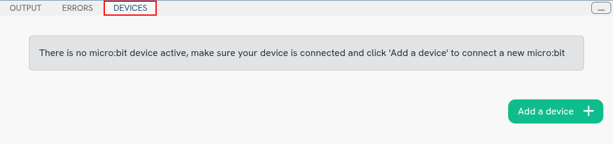
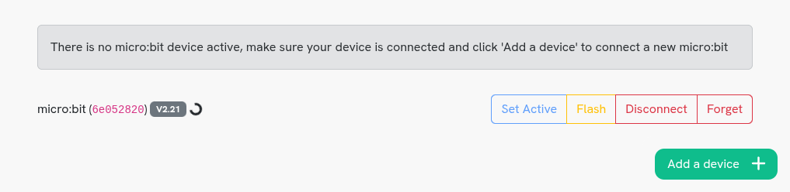

Setting up a micro:bit
======================

Pytch requires you to load special software onto your micro:bit in order to
communicate with it. You can follow the instructions below to set it up.

Connecting a micro:bit
----------------------

Once you have opened up any Pytch program, you can find the Devices pane at the
bottom of the screen, next to the Output and Error panes.

This pane will let you connect and manage micro:bit devices for use with Pytch.
You can add a new device you haven't used before using the 'Add a device' button
at the bottom-right corner of the pane. Your browser will then open a small
window with a list of valid devices to choose from. You should select an entry
that says 'BBC micro:bit CMSIS-DAP' or something similar. Your device should
then appear, similar to the image below.

If you have already loaded the Pytch software onto the micro:bit before, then
after a few seconds a green 'Connected' or blue 'Active' bubble should appear in
place of the wheel. If you haven't, then you will see a red 'Error' bubble
instead, along with an alert telling you to to update the micro:bit's Pytch
software, like in the image below.

.. image:: microbit-not-responding.png
   :alt: The Devices pane with a micro:bit that is missing the Pytch software

You can then use the yellow 'Flash' button to install the
software, and after about 30 seconds the green 'Connected' or blue 'Active'
bubble should appear. You shouldn't disconnect the micro:bit from your
computer while the wheel is spinning.

.. image:: microbit-active.png
   :alt: The Devices pane with an empty project and a micro:bit active

Once your micro:bit has been connected to Pytch once, it will automatically
reconnect if it is plugged in when you load a Pytch project.

Disconnecting a micro:bit
-------------------------

If you want to use your micro:bit with a different program, like MakeCode for
micro:bit or the micro:bit Python Editor, then you will need to disconnect it
from Pytch or close the Pytch tab. You don't need to disconnect the micro:bit
from Pytch before you unplug it from your computer or close your project.

If you do need to disconnect your micro:bit, there are two different options.
'Disconnect' only disconnects the micro:bit from Pytch temporarily, and the next
time you load a project the micro:bit will be reconnected automatically.
'Forget' disconnected the micro:bit from Pytch until you manually re-add it
by following the previous instructions.
