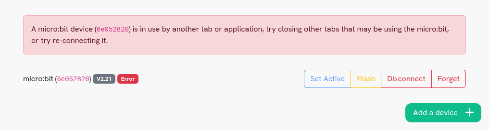
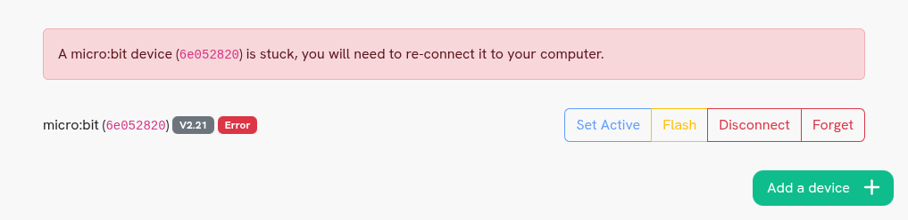
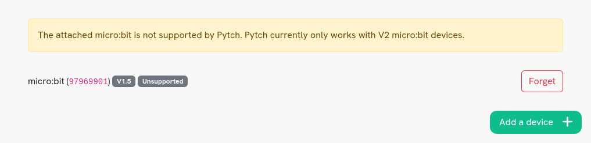
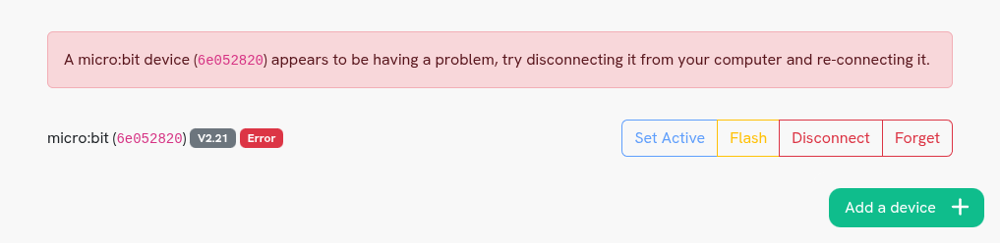

Troubleshooting issues with the micro:bit
=========================================

Sometimes you may encounter issues when connecting or using the micro:bit. This
page is designed to give you some guidance on how to handle these problems.

.. This page uses explicit targets above headers for easy linking from the IDE

.. _busy:

A micro:bit device is in use
----------------------------

         another tab or application

If another tab or application is already using the micro:bit, then Pytch may not
be able to connect to it. In this case, you should try to close other tabs which
may be using the micro:bit, like other Pytch tabs, MakeCode for micro:bit or the
micro:bit Python Editor. Then if you refresh your Pytch tab, Pytch should be
able to reconnect to the micro:bit. If that doesn't work, try unplugging the
micro:bit from your computer and plugging it back in while Pytch is open and
visible. If that still doesn't work, you can try restarting your computer and
only opening Pytch.

.. _stuck:

A micro:bit device is stuck
---------------------------

Sometimes the micro:bit can get 'stuck', where the computer is no longer able to
communicate with it properly. This sometimes happens when the page is refreshed
too quickly, or it is closed while Pytch is updating the software on the
micro:bit. The only way to fix this issue is to unplug the micro:bit from your
computer, wait a few seconds, then plug it back in again. The micro:bit should
then automatically reconnect to Pytch and show up as 'Connected' or 'Active'.

.. _no-response:

A micro:bit device is not responding
------------------------------------

.. image:: microbit-not-responding.png
   :alt: The Devices pane with a warning that a micro:bit device is not
         responding

If you have never used this micro:bit device with Pytch, then Pytch's software
needs to be loaded onto the micro:bit before it will work. You can do this by
clicking the yellow 'Flash' button, even if the device says 'Error' next to it.
Occasionally, this may happen even if you've used the micro:bit with Pytch
before. In this case, first try to refresh the tab to see if that helps, and if
it doesn't, try clicking the yellow 'Flash' button in case the Pytch software
has gotten overridden by another program.

.. _unsupported:

The attached micro:bit is not supported
---------------------------------------

         supported by Pytch

Pytch currently only supports V1.5 and V2 micro:bit boards, so this warning will
appear if the only detected micro:bit is a V1.3 board. These boards will also
have an 'Unsupported' bubble next to them. You will need to connect a supported
micro:bit if you want to use a micro:bit with Pytch. The version of the
micro:bit is in the bottom right corner on the back of the board.

.. _unknown:

A micro:bit device appears to be having a problem
-------------------------------------------------

         problem

If Pytch is unable to connect to a micro:bit but is not sure what the problem
is, then this message will appear. You should try unplugging the micro:bit from
your computer, waiting a few seconds, and then plugging it in again. If this
does not work, you can try using the 'Flash' button to re-install the Pytch
software on the micro:bit. If this also does not work, then there may be a
physical problem with your micro:bit or cable. You can try using a different USB
port, USB cable or micro:bit device and seeing if the issue persists. If the
issue occurs with Pytch but your micro:bit works fine with other programs
like MakeCode for micro:bit or the micro:bit Python Editor, then you should
`Contact Pytch </contact.html>`_.
