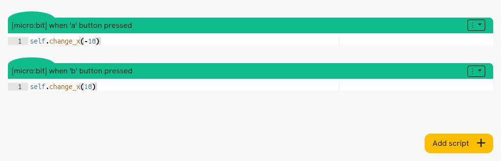
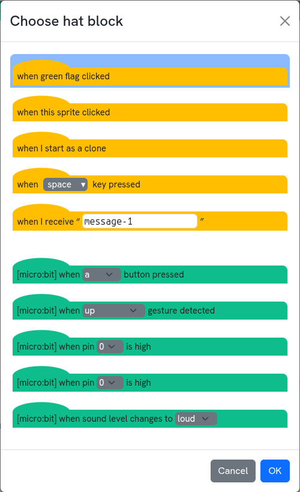
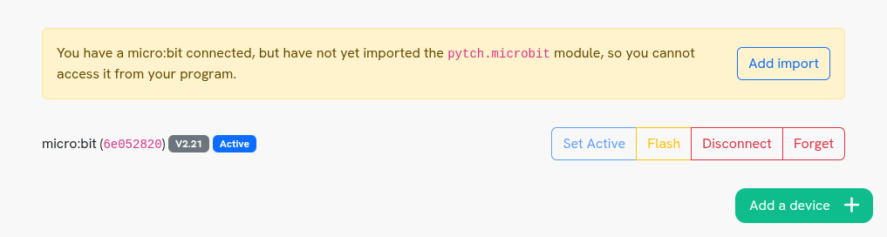
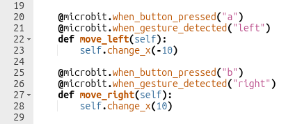

.. _microbit-usage:
Using the micro:bit in Pytch programs
=====================================

micro:bit functionality is available when editing a Pytch program as sprites and
scripts or as one big program, but there are some differences. You can reference
the full set of functions, hat blocks and variables by expanding the 'micro:bit'
section of the Help Sidebar on the left side of Pytch in either mode.

The following micro:bit functionality is supported:

* Display (showing images or text, scrolling text, and setting pixels)
* Buttons (including the micro:bit touch logo for V2 boards)
* Accelerometer/Gestures
* Microphone (V2 only)
* Music (V2 only)
* Temperature
* Light Level
* GPIO (Pins 0, 1 and 2 only)

Using with sprites and scripts
------------------------------

In sprites and scripts mode, micro:bit functionality is automatically available
via the ``microbit`` object when a micro:bit device is connected.

If you want to run a script in response to an event from the micro:bit device,
you can either use the 'Add script' button in the Code editor and select one of
the green micro:bit events, or you can drag one of the Scratch 'hat blocks' from
the Help Sidebar into the Code editor.

All of the micro:bit events have values to select from, such as the button to
detect presses from or the gesture to detect. If you want to change the value
you can double-click the 'hat' on the script, or click the three dots on the
right of the 'hat' then select 'Change hat block' and pick a new value using the
dropdown on the hat.

Note that micro:bit hat blocks will only show up in the 'Choose hat block' modal
if a micro:bit is connected.

Using with one big program
--------------------------

In one big program mode, micro:bit functionality needs to be imported before it
can be used. If you haven't imported the ``pytch.microbit`` module then you will
see a warning in the Devices pane like in the image below.

         module imported

You can either click the 'Add import' button and Pytch will automatically add an
import to your program, or you can manually add an import. We recommend using
``import pytch.microbit as microbit``, which allows you to access micro:bit
functionality via a ``microbit`` object. Note that the samples in the Help
Sidebar assume you are using this recommended import.

If you want to run some code in response to an event from the micro:bit device,
you can add a new method to a Sprite or the Stage and add a micro:bit 'hat',
such as ``@microbit.when_button_pressed("a")``.

All of the micro:bit events require a value, such as the button to detect
presses from or the gesture to detect. You can see all of the valid values for
an event by clicking 'show more...' next to the event in the 'micro:bit' section
of the Help Sidebar.
